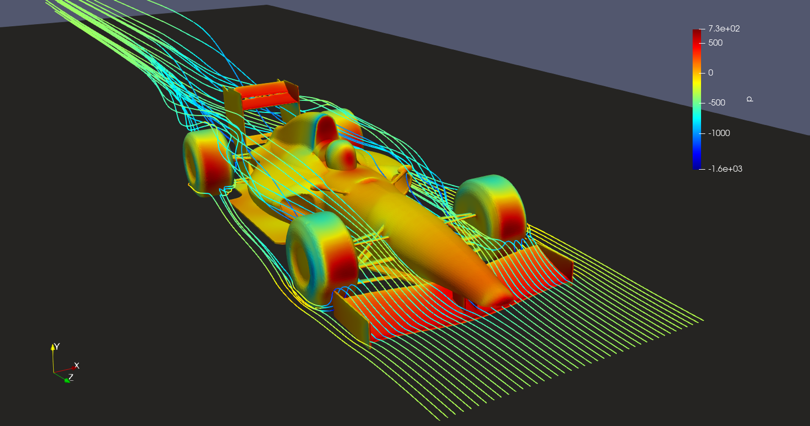

<meta name="google-site-verification" content="UZSnZbbvZqRUM_1_d5d9ox1IeO5z9iE8Oynt7mBjJaM" />

[![][docs-stable-img]][docs-stable-url] [![][docs-dev-img]][docs-dev-url] [![][CI-img]][CI-url] [![][JOSS-img]][JOSS-url]

[docs-stable-img]: https://img.shields.io/badge/docs-stable-blue.svg
[docs-stable-url]: https://mberto79.github.io/XCALibre.jl/stable/

[docs-dev-img]: https://img.shields.io/badge/docs-dev-blue.svg
[docs-dev-url]: https://mberto79.github.io/XCALibre.jl/dev/

[CI-img]: https://github.com/mberto79/XCALibre.jl/actions/workflows/CI.yml/badge.svg
[CI-url]: https://github.com/mberto79/XCALibre.jl/actions/workflows/CI.yml

[JOSS-img]: https://joss.theoj.org/papers/10.21105/joss.07441/status.svg
[JOSS-url]: https://doi.org/10.21105/joss.07441


# XCALibre.jl

*XPU CFD Algorithms and libraries*

## What is XCALibre.jl?


XCALibre.jl (pronounced as the mythical sword *Excalibur*) is a general purpose Computational Fluid Dynamics (CFD) library for 2D and 3D simulations on structured/unstructured grids using the finite volume method. XCALibre.jl has been designed to act as a platform for developing, testing and using *XPU CFD Algorithms and Libraries* to give researchers in both academia and industry alike a tool that can be used to test out ideas easily within a framework that offers acceptable performance. To this end, XCALibre.jl has been implemented to offer both CPU multi-threaded capabilities or GPU acceleration using the same codebase (thanks to the unified programming framework provided by [KernelAbstractions.jl](https://juliagpu.github.io/KernelAbstractions.jl/stable/)). XCALibre.jl also offers a friendly API for those users who are interested in running CFD simulations with the existing solvers and models built into XCALibre.jl. 

#### Large Eddy Simulation


#### Reynolds-Averaged Navier-Stokes Simulation

(mesh file downloaded from [FetchCFD](https://fetchcfd.com/view-project/136-f1-mesh-for-simulation#))

## Installation


First, you need to [download and install Julia on your system](https://julialang.org/downloads/). Once you have a working installation of Julia, XCALibre.jl can be installed using the built-in package manager. 

XCALibre.jl is available directly from the the General Julia Registry. Thus, to install XCALibre.jl open a Julia REPL, press `]` to enter the package manager. The REPL prompt icon will change from **julia>** (green) to **pkg>** (and change colour to blue) or **(myenvironment) pkg>** where `myenvironment` is the name of the currently active Julia environment. Once you have activated the package manager mode enter

```julia
pkg> add XCALibre
```

To install XCALibre.jl directly from Github enter the following command (for the latest release)

```julia
pkg> add XCALibre https://github.com/mberto79/XCALibre.jl.git
```

A specific branch can be installed by providing the branch name precided by a `#`, for example, to install the `dev-0.3-main` branch enter

```julia
pkg> add XCALibre https://github.com/mberto79/XCALibre.jl.git#dev-0.3-main
```

## Main features


* Multithreaded or GPU execution with support for multiple GPU backends  (NVidia, AMD and Intel) - as supported by [KernelAbstractions.jl](https://juliagpu.github.io/KernelAbstractions.jl/stable/)(except Apple hardware)
* Ability to import *.unv* and OpenFOAM grids. Simulation results written in `VTK` or `OpenFOAM` file formats, allowing postprocessing in [ParaView](https://www.paraview.org/)
* Incompressible and (weakly) compressible flow solvers
* RANS and LES turbulence modelling (`KOmega` and `KOmegaLKE` for RANS and `Smagorinsky` for LES, for now!)
* Energy modelling using Sensible Energy model
* Classic boundary conditions, including Dirichlet, Neumann, Wall, Symmetry, etc.
* User-defined boundary conditions as neural networks or user-defined functions (source/sink terms soon)
* Easy to link with Julia ecosystem - making it easy to embed custom machine learning models, perform optimisation runs, etc. (see examples in the [documentation](https://mberto79.github.io/XCALibre.jl/stable/))
* A good selection of discretisation schemes available e.g. Euler, Upwind, LUST, etc.
* Simple API for defining new transport equations or solvers

Code example

```julia
U_eqn = (
          Time{schemes.U.time}(U)
        + Divergence{schemes.U.divergence}(mdotf, U) 
        - Laplacian{schemes.U.laplacian}(nueff, U) 
        == 
        -Source(∇p.result)

      ) → VectorEquation(mesh)
```

## Main dependencies


XCALibre.jl relies on the functionality provided by other packages from the Julia ecosystem. For a full list of direct dependencies please refer to the Project.toml file included with this repository. We are thankful to the teams that have helped develop and maintain every single of our dependencies. Major functionally is provided by the following:

* KernelAbstractions.jl - provides a unified parallel programming framework for CPUs and GPUs
* Krylov.jl - provides solvers for linear systems at the heart of XCALibre.jl
* LinearOperators.jl - wrappers for matrices and linear operators
* Atomix.jl - enables atomix operations to ensure race conditions are avoided in parallel kernels
* CUDA.jl, AMD.jl, Metal.jl and OneAPI.jl - not direct dependencies but packages enabling GPU usage in Julia
* StaticArrays.jl - provides definitions and performant primitives for working with vectors and matrices

## Related projects


There are other wonderful fluid simulation packages available in the Julia ecosystem (please let us know if we missed any):

* [Oceananigans.jl](https://github.com/CliMA/Oceananigans.jl) 
* [Waterlilly.jl](https://github.com/WaterLily-jl/WaterLily.jl) 
* [Trixi.jl](https://github.com/trixi-framework/Trixi.jl)

## How to Cite

If you have used XCALibre.jl in your work, please cite it using the reference below:

```
@article{Medina2025, 
  author = {Humberto Medina and Christopher D. Ellis and Tom Mazin and Oscar Osborn and Timothy Ward and Stephen Ambrose and Svetlana Aleksandrova and Benjamin Rothwell and Carol Eastwick}, 
  title = {XCALibre.jl: A Julia XPU unstructured finite volume Computational Fluid Dynamics library}, 
  journal = {Journal of Open Source Software},
  publisher = {The Open Journal}, 
  volume = {10}, 
  number = {107}, 
  pages = {7441}, 
  year = {2025}, 
  doi = {10.21105/joss.07441}, 
  url = {https://doi.org/10.21105/joss.07441}
}
```
  
